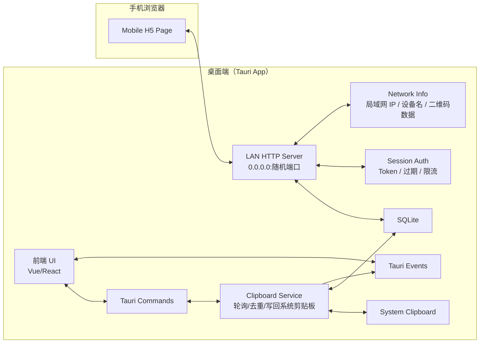
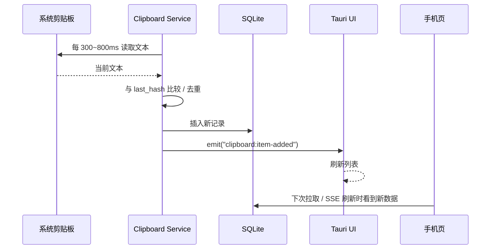
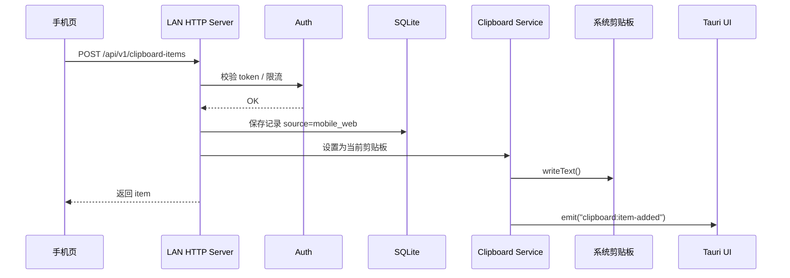
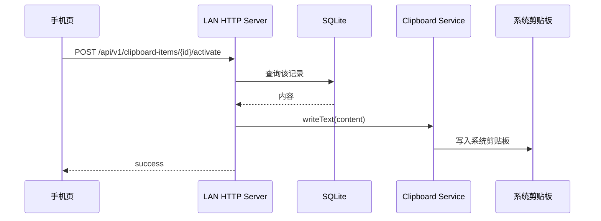

下面给你一版 **Tauri 云剪贴板 MVP**，按“能尽快做出来、后续还能扩展”来设计。
这个方案基于 Tauri 2：前端跑在系统 WebView 里，前后端通过 Tauri command / event 通信；剪贴板可用官方 clipboard 插件；官方也明确提示 localhost 暴露有明显安全风险，所以你这种“给手机扫二维码访问”的能力，设计上必须把认证和权限边界单独做好。([Tauri][1])

---

# 一、MVP 目标

先只做这几个能力：

* 桌面端监听文本剪贴板
* 保存剪贴板历史列表
* 桌面端起一个局域网 HTTP 服务
* 展示二维码，内容是 `http://局域网IP:端口/?token=...`
* 手机浏览器扫码后：

  * 查看历史
  * 提交文本到桌面端
  * 点某条历史，让桌面端把它设为当前剪贴板
* 不依赖公网服务器
* 不做账号系统
* 不做图片/文件，**只做纯文本**

---

# 二、完整架构图

## 1）逻辑架构图



---

## 2）运行时时序图

### A. 桌面端复制新内容



### B. 手机推送文本到电脑



### C. 手机点击历史中的某条“设为当前剪贴板”



---

# 三、模块划分

## 1）前端 UI 层

职责：

* 展示剪贴板列表
* 展示二维码、设备名、LAN 地址
* 展示连接状态
* 搜索/置顶/删除
* 接收 Tauri event 刷新界面

建议页面：

* `/desktop`：桌面主界面
* `/mobile`：手机预览页
* 手机实际访问的是 Rust HTTP server 返回的 H5，不直接走 Tauri WebView

---

## 2）Tauri command 层

职责：

* 前端调 Rust
* 初始化状态
* 获取配置
* 获取会话地址和二维码信息
* 触发剪贴板写入
* 管理服务启停

因为 Tauri 官方 command 机制支持参数、返回值、异步和错误，这一层很适合当桌面 UI 与 Rust 服务之间的主入口。([Tauri][2])

---

## 3）Clipboard Service

职责：

* 周期性读取系统剪贴板
* 只处理 `text/plain`
* 去重
* 记录来源
* 写回系统剪贴板
* 通过 event 通知前端

官方 clipboard 插件支持系统剪贴板读写；在移动端只保证纯文本支持，所以你的 MVP 先做文本是最稳妥的。([Tauri][3])

---

## 4）LAN HTTP Server

职责：

* 对手机暴露 H5 页面
* 对手机暴露 REST API
* 可选 SSE 推送实时更新
* 统一做 token 校验、限流、来源记录

不建议把“手机访问页”简单理解成 Tauri localhost 插件直接裸暴露，因为官方对 localhost 暴露专门给了安全警告。([Tauri][4])

---

## 5）SQLite

职责：

* 持久化剪贴板历史
* 去重索引
* 会话 token
* 设备信息
* 基础配置

---

## 6）Auth / Session

职责：

* 当前会话 token
* token 过期时间
* 连接会话状态
* QR 刷新
* 限流
* 简单审计日志

---

# 四、API 设计

接口风格：
`/api/v1/...`

认证方式：

* 首选 `Authorization: Bearer <token>`
* 兼容二维码 URL 上的 `?token=...`
* 手机页首次进入后把 token 存在内存或 sessionStorage
* 所有写接口都必须校验 token

统一返回：

```json
{
  "ok": true,
  "data": {},
  "error": null,
  "ts": 1770000000000
}
```

错误返回：

```json
{
  "ok": false,
  "data": null,
  "error": {
    "code": "UNAUTHORIZED",
    "message": "invalid token"
  },
  "ts": 1770000000000
}
```

---

## 1）会话与状态接口

### GET /api/v1/session

用途：获取当前会话信息

响应：

```json
{
  "ok": true,
  "data": {
    "deviceName": "Addams-PC",
    "host": "192.168.1.23",
    "port": 38471,
    "baseUrl": "http://192.168.1.23:38471",
    "tokenExpiresAt": "2026-03-15T23:30:00+08:00",
    "readOnly": false,
    "maxTextBytes": 1048576
  }
}
```

---

### POST /api/v1/session/rotate-token

用途：刷新 token，旧二维码失效

请求体：

```json
{
  "expireMinutes": 60
}
```

响应：

```json
{
  "ok": true,
  "data": {
    "token": "new_token",
    "qrUrl": "http://192.168.1.23:38471/?token=new_token",
    "expiresAt": "2026-03-15T23:30:00+08:00"
  }
}
```

---

### GET /api/v1/health

用途：健康检查

响应：

```json
{
  "ok": true,
  "data": {
    "status": "up",
    "serverTime": "2026-03-15T22:00:00+08:00"
  }
}
```

---

## 2）剪贴板记录接口

### GET /api/v1/clipboard-items

用途：分页获取历史列表

查询参数：

* `cursor` 可选
* `limit` 默认 30，最大 100
* `q` 可选，搜索
* `pinnedOnly` 可选
* `sinceId` 可选，用于增量刷新

示例：
`GET /api/v1/clipboard-items?limit=30&q=hello`

响应：

```json
{
  "ok": true,
  "data": {
    "items": [
      {
        "id": "cbi_01",
        "content": "hello world",
        "contentType": "text/plain",
        "preview": "hello world",
        "charCount": 11,
        "sourceDeviceId": "dev_desktop_a",
        "sourceKind": "desktop_local",
        "createdAt": "2026-03-15T21:58:00+08:00",
        "pinned": false,
        "isCurrent": true
      }
    ],
    "nextCursor": "..."
  }
}
```

---

### POST /api/v1/clipboard-items

用途：手机推送一条文本到桌面端，同时默认写入当前系统剪贴板

请求体：

```json
{
  "content": "待粘贴文本",
  "contentType": "text/plain",
  "activate": true
}
```

响应：

```json
{
  "ok": true,
  "data": {
    "item": {
      "id": "cbi_02",
      "content": "待粘贴文本",
      "contentType": "text/plain",
      "preview": "待粘贴文本",
      "charCount": 5,
      "sourceDeviceId": "dev_mobile_web_anon",
      "sourceKind": "mobile_web",
      "createdAt": "2026-03-15T22:02:00+08:00",
      "pinned": false,
      "isCurrent": true
    }
  }
}
```

规则：

* 超过大小限制拒绝
* 空字符串可按配置允许或拒绝
* 相同 hash 且短时间内重复，可直接返回已有记录

---

### GET /api/v1/clipboard-items/{id}

用途：取单条详情

响应：

```json
{
  "ok": true,
  "data": {
    "id": "cbi_02",
    "content": "完整文本",
    "contentType": "text/plain",
    "hash": "sha256:xxx",
    "sourceKind": "mobile_web",
    "createdAt": "2026-03-15T22:02:00+08:00"
  }
}
```

---

### POST /api/v1/clipboard-items/{id}/activate

用途：把某条历史写入当前系统剪贴板

请求体：

```json
{
  "alsoMarkRecent": true
}
```

响应：

```json
{
  "ok": true,
  "data": {
    "activated": true,
    "currentItemId": "cbi_02"
  }
}
```

---

### PATCH /api/v1/clipboard-items/{id}

用途：更新记录元数据

请求体：

```json
{
  "pinned": true
}
```

响应：

```json
{
  "ok": true,
  "data": {
    "id": "cbi_02",
    "pinned": true
  }
}
```

---

### DELETE /api/v1/clipboard-items/{id}

用途：逻辑删除一条记录

响应：

```json
{
  "ok": true,
  "data": {
    "deleted": true
  }
}
```

---

## 3）实时刷新接口

### GET /api/v1/events

用途：SSE 订阅实时事件
返回事件流：

事件类型：

* `clipboard.item_added`
* `clipboard.item_updated`
* `clipboard.item_deleted`
* `session.rotated`

示例消息：

```text
event: clipboard.item_added
data: {"id":"cbi_03","preview":"abc","createdAt":"2026-03-15T22:03:00+08:00"}
```

为什么建议 SSE：

* 比 WebSocket 简单
* 手机页只需要“服务端推送更新”
* 你的场景交互不复杂

---

# 五、Tauri command 设计

桌面 UI 到 Rust 的命令接口建议这样拆：

## app 初始化

* `app_init()`
* `get_runtime_state()`
* `get_server_info()`

## 服务控制

* `start_lan_server()`
* `stop_lan_server()`
* `restart_lan_server()`

## 剪贴板

* `read_current_clipboard()`
* `write_clipboard_text(content: String)`
* `list_clipboard_items(query, limit, cursor)`
* `pin_clipboard_item(id, pinned)`
* `delete_clipboard_item(id)`
* `activate_clipboard_item(id)`

## 会话

* `rotate_session_token(expire_minutes)`
* `get_qr_payload()`

## 配置

* `get_settings()`
* `save_settings(settings)`

Rust 端再通过 event 推给前端：

* `clipboard:item-added`
* `clipboard:item-updated`
* `clipboard:item-deleted`
* `server:status-changed`

Tauri 官方支持 Rust 侧调用前端，事件系统正适合这个通知流。([Tauri][5])

---

# 六、数据表设计

建议 SQLite 先 5 张表就够。

---

## 1）clipboard_items

主表：剪贴板历史

```sql
CREATE TABLE clipboard_items (
  id TEXT PRIMARY KEY,
  content TEXT NOT NULL,
  content_type TEXT NOT NULL DEFAULT 'text/plain',
  content_hash TEXT NOT NULL,
  preview TEXT NOT NULL,
  char_count INTEGER NOT NULL DEFAULT 0,
  source_device_id TEXT,
  source_kind TEXT NOT NULL,         -- desktop_local / mobile_web / desktop_remote
  created_at TEXT NOT NULL,
  updated_at TEXT NOT NULL,
  pinned INTEGER NOT NULL DEFAULT 0,
  deleted INTEGER NOT NULL DEFAULT 0,
  activated_at TEXT,
  extra_json TEXT
);

CREATE INDEX idx_clipboard_items_created_at
ON clipboard_items(created_at DESC);

CREATE INDEX idx_clipboard_items_hash
ON clipboard_items(content_hash);

CREATE INDEX idx_clipboard_items_pinned_created
ON clipboard_items(pinned DESC, created_at DESC);
```

字段说明：

* `content_hash`：去重
* `preview`：列表展示，避免每次现算
* `activated_at`：最近一次被写回系统剪贴板的时间
* `extra_json`：给以后扩展 HTML、图片元信息留口子

---

## 2）devices

记录设备来源

```sql
CREATE TABLE devices (
  id TEXT PRIMARY KEY,
  name TEXT NOT NULL,
  device_type TEXT NOT NULL,         -- desktop / mobile_web
  first_seen_at TEXT NOT NULL,
  last_seen_at TEXT NOT NULL,
  last_ip TEXT,
  meta_json TEXT
);
```

MVP 虽然没真正多端发现，但先留表很值。

---

## 3）sessions

二维码会话 / token

```sql
CREATE TABLE sessions (
  id TEXT PRIMARY KEY,
  token TEXT NOT NULL UNIQUE,
  status TEXT NOT NULL,              -- active / expired / revoked
  created_at TEXT NOT NULL,
  expires_at TEXT NOT NULL,
  last_used_at TEXT,
  created_by_device_id TEXT,
  meta_json TEXT
);

CREATE INDEX idx_sessions_status_expires
ON sessions(status, expires_at);
```

---

## 4）app_settings

KV 配置表

```sql
CREATE TABLE app_settings (
  key TEXT PRIMARY KEY,
  value TEXT NOT NULL,
  updated_at TEXT NOT NULL
);
```

推荐保存：

* `server_port`
* `server_bind_mode`：`0.0.0.0` / `127.0.0.1`
* `clipboard_poll_interval_ms`
* `max_history_count`
* `max_text_bytes`
* `token_expire_minutes`
* `auto_start`
* `minimize_to_tray`

---

## 5）audit_logs

审计日志，方便查问题

```sql
CREATE TABLE audit_logs (
  id TEXT PRIMARY KEY,
  event_type TEXT NOT NULL,          -- push_text / activate_item / rotate_token / auth_fail
  actor_device_id TEXT,
  actor_ip TEXT,
  detail_json TEXT,
  created_at TEXT NOT NULL
);

CREATE INDEX idx_audit_logs_created_at
ON audit_logs(created_at DESC);
```

---

# 七、核心业务规则

## 1）入库规则

* 只存 `text/plain`
* 空文本默认不入库
* 长度超限拒绝
* 对内容做 `sha256`
* 若与最近一条 hash 相同，则不重复插入
* 若 3 秒内连续相同，可只刷新 `updated_at`

## 2）当前剪贴板规则

* “当前剪贴板”不是单独一条状态表
* 谁最近被 activate，谁就是当前项
* 可在内存里维护 `current_item_id`
* UI 列表里通过它高亮

## 3）保留策略

* 默认最多保留 1000 条
* 超出后删除最旧且未 pinned 的记录
* deleted 先逻辑删，定时再物理清理

---

# 八、安全设计

这是这个项目最容易被忽略的部分。

## 最低要求

* 二维码必须带随机 token
* token 默认 30~60 分钟过期
* 支持手动失效
* 所有写接口校验 token
* 限制请求体大小，例如 1 MB
* 基础限流，例如每 IP 每分钟 60 次
* 记录失败鉴权日志
* 不开放文件上传
* 手机页默认不显示过多历史，避免肩窥

Tauri 官方对 localhost 暴露给过明确安全警告；Tauri 还有 capability / permission / CSP 等安全机制，桌面 UI 和本地服务都应该按最小权限来做。([Tauri][4])

## 建议再加两条

* 可选“只允许当前扫码设备会话”
* 可选“只读模式”，手机只能看历史，不能 push

---

# 九、目录结构建议

```text
src/
  app/
    desktop/
      DesktopPage.tsx
      QrPanel.tsx
      ClipboardList.tsx
    shared/
      api.ts
      types.ts
      state.ts
  mobile-preview/
    MobilePreview.tsx

src-tauri/
  src/
    main.rs
    commands.rs
    state.rs
    clipboard/
      service.rs
      polling.rs
      writer.rs
    http/
      server.rs
      routes.rs
      auth.rs
      sse.rs
    db/
      mod.rs
      schema.sql
      clipboard_repo.rs
      session_repo.rs
      settings_repo.rs
      audit_repo.rs
    network/
      lan.rs
      qrcode.rs
    models/
      clipboard_item.rs
      session.rs
      device.rs
      settings.rs
```

---

# 十、MVP 页面结构

## 桌面端

左侧：

* 搜索框
* 历史列表
* pin / delete / activate

右侧：

* 当前设备名
* 局域网地址
* 二维码
* token 过期时间
* 重新生成二维码
* 服务开关

## 手机页

顶部：

* 设备名
* 连接状态

中间：

* 输入框
* “发送到电脑剪贴板”

下方：

* 最近历史列表
* 每项：

  * 复制到手机
  * 设为电脑当前剪贴板

---

# 十一、最小可落地的开发顺序

1. Tauri UI 跑起来
2. clipboard 文本读写跑通
3. SQLite 建表与历史列表
4. 轮询监听 + 去重
5. 局域网 HTTP server
6. 手机页静态 H5
7. `POST /clipboard-items`
8. `POST /clipboard-items/{id}/activate`
9. 二维码与 token
10. SSE 实时刷新
11. 审计日志 / 限流 / token 轮换

---

# 十二、我给你的落地结论

这版 MVP 的核心设计可以概括成一句：

**Tauri 负责桌面壳、系统能力和本地状态；Rust HTTP server 负责手机接入；SQLite 负责历史与会话；二维码只是“局域网入口 + token”，不是同步本身。**

如果你愿意，我下一条直接给你补一版 **Rust 接口定义 + SQLite schema.sql + 前端 TypeScript 类型声明**。

[1]: https://v2.tauri.app/blog/tauri-20/?utm_source=chatgpt.com "Tauri 2.0 Stable Release"
[2]: https://v2.tauri.app/develop/calling-rust/?utm_source=chatgpt.com "Calling Rust from the Frontend"
[3]: https://v2.tauri.app/plugin/clipboard/?utm_source=chatgpt.com "Clipboard"
[4]: https://v2.tauri.app/plugin/localhost/?utm_source=chatgpt.com "Localhost"
[5]: https://v2.tauri.app/develop/calling-frontend/?utm_source=chatgpt.com "Calling the Frontend from Rust"
