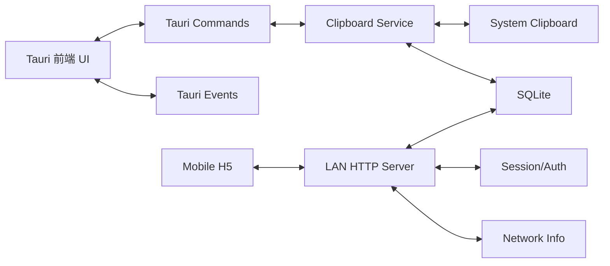

# Tauri 云剪贴板 MVP 技术设计

## 1. 背景与目标

该项目是一个基于 Tauri 2 的桌面剪贴板同步工具，目标是在不依赖公网服务器和账号系统的前提下，实现桌面端监听文本剪贴板、保存历史、通过局域网让手机浏览器查看和提交文本，并可将历史记录一键写回桌面系统剪贴板。

设计原则：

- 只做纯文本，先保证可用和安全
- 桌面端与手机端共享同一套数据源
- 局域网暴露能力必须有明确的认证和权限边界
- 方案要便于后续扩展到图片、文件和多设备协作

## 2. UI/UX 设计

### 2.1 桌面端

桌面端是主控制台，承担状态展示、历史管理、二维码分发和服务控制。

主要区域：

- 顶部状态栏：设备名、局域网地址、服务状态、连接人数、token 过期时间
- 左侧历史列表：按时间倒序展示剪贴板记录，支持搜索、置顶、删除
- 右侧详情面板：显示当前选中内容、完整文本、来源、时间、字符数、操作按钮
- 右上角二维码卡片：展示当前会话二维码和刷新按钮

交互要点：

- 新内容进入时，列表首位高亮并轻量提示
- 当前剪贴板项显示 `Current` 标记
- 搜索仅过滤本地历史，不影响写入链路
- 置顶项固定在列表顶部，且不打断时间排序的主逻辑
- 服务不可用时明确提示原因，例如端口占用、网络地址不可达、权限不足

### 2.2 手机端

手机端是轻量 H5 页面，核心目标是“快看、快发、快选”。

主要区域：

- 顶部状态区：设备名、在线状态、当前会话有效期
- 文本输入区：提交内容到桌面端
- 历史列表区：查看最近记录，支持点按激活
- 简单筛选：搜索、仅看置顶、刷新

交互要点：

- 首次打开后尽快拉取历史，避免空白页
- 写入成功后立即刷新列表并回到顶部
- 点按历史项直接激活，不要求二次确认
- 会话失效时提示重新扫码

### 2.3 响应式和视觉建议

- 桌面端采用三栏式或双栏式布局，确保信息密度和操作效率
- 手机端采用单列卡片布局，控制首屏信息量
- 视觉上区分“主机状态”“历史记录”“输入操作”三类内容
- 对高频状态使用颜色和徽标，不使用复杂动效

## 3. 系统架构

### 3.1 总体结构



### 3.2 核心流程

1. 应用启动后初始化配置、数据库、局域网信息和 token 会话
2. Clipboard Service 周期性读取系统剪贴板文本并去重
3. 新文本落库后同步到前端事件总线
4. LAN HTTP Server 对外提供 H5 页面和 API
5. 手机通过二维码进入后在 token 有效期内访问历史、提交文本、激活记录

### 3.3 关键原则

- 剪贴板监听和 HTTP 服务解耦，避免页面请求影响桌面监听
- 所有写操作都必须走服务端校验，不能直接由前端写 SQLite
- 事件推送只用于刷新，不作为业务一致性的唯一来源

## 4. 技术栈

- 桌面壳：Tauri 2
- 后端核心：Rust
- 前端：Vue 3 + TypeScript + Vite
- 包管理：Cargo + pnpm(volta)
- UI 样式：Tailwind CSS + SCSS
- 数据库：SQLite
- 剪贴板能力：Tauri 官方 clipboard 插件
- 局域网服务：Rust HTTP 框架，优先选轻量方案实现 REST + SSE
- 序列化：`serde`
- 日志：`tracing`

说明：

- 前端仅负责展示和交互，不承载核心状态
- Vue 3 用于桌面端与手机端页面开发，Tailwind CSS 用于原子化布局，SCSS 用于组件级样式组织与主题扩展
- Rust 负责服务、认证、数据库和剪贴板 I/O
- 前后端通过命令、事件和 HTTP API 协作

## 5. API 设计

### 5.1 认证方式

- 首选 `Authorization: Bearer <token>`
- 二维码 URL 可携带 `?token=...`
- 手机页进入后将 token 保存在 session 级别，不持久化到长期存储

### 5.2 统一返回格式

```json
{
  "ok": true,
  "data": {},
  "error": null,
  "ts": 1770000000000
}
```

错误格式：

```json
{
  "ok": false,
  "data": null,
  "error": {
    "code": "UNAUTHORIZED",
    "message": "invalid token"
  },
  "ts": 1770000000000
}
```

### 5.3 主要接口

- `GET /api/v1/session`：返回设备名、主机地址、端口、二维码 URL、token 过期时间、只读状态、最大文本大小
- `POST /api/v1/session/rotate-token`：刷新 token，使旧二维码失效
- `GET /api/v1/health`：健康检查
- `GET /api/v1/clipboard-items`：分页获取历史列表，支持搜索、置顶过滤和增量刷新
- `POST /api/v1/clipboard-items`：手机提交文本并可选择立即激活
- `GET /api/v1/clipboard-items/{id}`：获取单条详情
- `POST /api/v1/clipboard-items/{id}/activate`：把历史内容写回系统剪贴板
- `PATCH /api/v1/clipboard-items/{id}`：更新元数据，例如置顶
- `DELETE /api/v1/clipboard-items/{id}`：逻辑删除
- `GET /api/v1/events`：SSE 实时订阅

### 5.4 错误码建议

- `UNAUTHORIZED`：token 无效或过期
- `FORBIDDEN`：只读模式下执行写操作
- `PAYLOAD_TOO_LARGE`：文本超出上限
- `INVALID_ARGUMENT`：参数格式错误
- `RATE_LIMITED`：请求过于频繁
- `NOT_FOUND`：记录不存在
- `CONFLICT`：重复提交或状态冲突

## 6. 数据库设计

### 6.1 表结构

#### `devices`

保存桌面设备自身信息。

- `id`：主键
- `name`：设备名
- `created_at`
- `updated_at`

#### `sessions`

保存当前会话 token 和过期信息。

- `id`：主键
- `token_hash`：仅保存哈希，不明文落库
- `expires_at`
- `status`：active / rotated / expired
- `created_at`
- `rotated_at`

#### `clipboard_items`

保存剪贴板记录。

- `id`：主键，建议使用字符串 ID
- `content`：完整文本
- `content_type`：固定为 `text/plain`
- `hash`：内容哈希
- `preview`：预览文本
- `char_count`
- `source_kind`：desktop_local / mobile_web
- `source_device_id`
- `pinned`：是否置顶
- `is_current`：是否为当前剪贴板
- `deleted_at`：逻辑删除时间
- `created_at`
- `updated_at`

#### `audit_logs`

保存关键操作审计。

- `id`
- `action`：create / activate / delete / rotate_token / reject
- `item_id`
- `ip`
- `user_agent`
- `reason`
- `created_at`

#### `app_settings`

保存配置项。

- `key`
- `value`
- `updated_at`

### 6.2 索引建议

- `clipboard_items(hash)`：用于去重
- `clipboard_items(created_at desc)`：用于历史列表
- `clipboard_items(pinned, created_at desc)`：用于置顶和排序
- `sessions(token_hash)`：用于 token 校验
- `audit_logs(created_at desc)`：用于排查问题

### 6.3 数据规则

- 历史记录采用逻辑删除，避免频繁物理删改
- 置顶与时间排序分离，保证列表排序稳定
- 重复内容在短时间窗口内可复用已有记录
- 当前剪贴板只允许有一条有效记录

## 7. 关键模块

### 7.1 Clipboard Service

职责：

- 周期性读取系统剪贴板文本
- 做哈希去重和大小限制
- 写入数据库并更新当前项
- 将变更广播给前端和 SSE 客户端

### 7.2 LAN HTTP Server

职责：

- 向手机提供 H5 页面和 REST API
- 统一鉴权、限流和请求日志
- 负责 token 生命周期管理

### 7.3 Session/Auth

职责：

- 生成和轮换 token
- 维护 token 过期状态
- 为写操作提供权限判定

### 7.4 Frontend UI

职责：

- 展示历史和状态
- 提供搜索、置顶、删除、激活和二维码信息
- 接收事件并更新界面

### 7.5 Persistence Layer

职责：

- 封装 SQLite 读写
- 提供事务边界
- 统一字段校验和数据迁移入口

## 8. 安全与权限

- 不开放公网访问，只允许局域网绑定地址
- token 只通过短期会话分发，不做长期账号体系
- 明文 token 不落库，至少保留哈希
- 所有写接口都必须鉴权，包括提交、激活、删除、置顶和 token 轮换
- 限制单次文本长度和请求频率，防止滥用和内存压力
- 手机端 token 不写入长期本地存储，避免被其他站点轻易窃取
- 二维码过期后必须失效，不允许旧链接长期复用
- 审计日志记录来源 IP、时间和动作类型

## 9. 部署与运维

### 9.1 本地运行

- 桌面应用启动后自动检测可用端口
- 若端口冲突，自动尝试随机端口并重新生成二维码
- 启动失败时给出可操作的错误信息

### 9.2 服务健康

- 提供 `GET /api/v1/health`
- 前端展示服务存活、网络地址和二维码状态
- token 轮换后前端要立即刷新二维码

### 9.3 日志

- 记录服务启动、端口绑定、token 轮换、写入、激活、删除和异常
- 日志分级建议为 `error`、`warn`、`info`、`debug`
- 请求日志默认脱敏 token 和完整剪贴板内容

### 9.4 运维要点

- 首次启动需要引导用户确认局域网访问风险
- 若系统剪贴板监听权限异常，应明确提示用户处理权限问题
- 数据库文件建议放在应用私有目录，随版本升级执行迁移

## 10. 风险与演进

### 10.1 主要风险

- 局域网暴露带来的未授权访问风险
- 系统剪贴板轮询带来的性能和耗电问题
- 不同平台 WebView 和网络权限差异
- 手机浏览器的会话保持和跨站限制

### 10.2 缓解策略

- 使用短期 token 和过期机制
- 剪贴板轮询可配置，默认采用温和频率
- API 与 UI 分离，降低前端故障面
- 请求日志和审计日志协助排查异常访问

### 10.3 后续演进

- 支持图片和文件类型
- 增加多设备发现与配对
- 增加端到端加密或本地密钥派生
- 增加更细粒度的权限控制，例如只读、仅推送、仅本机访问
- 增加快捷搜索、标签、分组和收藏

## 11. 验收口径

- 桌面端可稳定监听文本剪贴板并入库
- 手机扫码后能查看历史并提交新文本
- 点选历史项可成功写回桌面剪贴板
- token 过期后旧二维码不可继续访问
- 服务可在局域网内正常访问，重启后数据仍可恢复
- 仅文本链路在 MVP 范围内闭环，其他类型明确不支持
